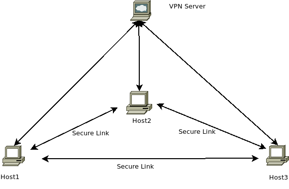

# Simple-VPN

This project is a VPN-server, written in golang, using websockets as a transport.  The idea is that multiple-nodes each connect to a central VPN-server, and once connected they can talk to _each other_ securely, regardless of NAT and location.

The following image illustrates the expected setup:

* Three hosts each connect to the central VPN host.
* Once they're connected any host can talk to the others, securely & privately.

While you _could_ use this software to mask your laptop's IP while traveling, instead showing the IP of the VPN-server as being the source of connections this is __not__ the expected use-case.

> The VPN will be a single point of failure, but being a simple service and easily deployed it should be trivial to spin up a replacement in a hurry.

## Encryption

The VPN-server __does not__ implement any kind of encryption itself, nor does it handle access-control beyond the use of a shared-secret.

Is this insane?  Actually no.  I'd rather add no encryption than badly implemented encryption!

* The use of TLS prevents traffic from being sniffed.
* The use of a shared-secret prevents rogue agents from connecting to your VPN-server.

In practice I believe this is secure enough.

## Installation

Providing you have a working go-installation you should be able to
install this software by running:

    go get -u github.com/skx/simple-vpn

> **NOTE**: If you've previously downloaded the code this will update your installation to the most recent available version.

## VPN-Server Setup

Configuring a VPN server requires two things:

* The `simple-vpn` binary to be running in server-mode.
  * This requires the use of a simple configuration-file.
* Your webserver to proxy (websocket) requests to it.
  * You __must__ ensure that your webserver uses TLS to avoid sniffing.

A minimal configuration file for the server looks like this:

* [etc/server.cfg](etc/server.cfg)

With your configuration-file you can now launch the VPN-server like so:

     # simple-vpn server ./server.cfg

To proxy traffic to this server, via `nginx`, you could have a configuration file like this:

    server {
        server_name vpn.example.com;
        listen [::]:443  default ipv6only=off ssl;

        ssl on;
        ssl_certificate      /etc/lets.encrypt/ssl/vpn.example.com.full;
        ssl_certificate_key  /etc/lets.encrypt/ssl/vpn.example.com.key;
        ssl_dhparam /etc/nginx/ssl/dhparam.pem;

        ssl_prefer_server_ciphers on;
        ssl_protocols TLSv1 TLSv1.1 TLSv1.2;
        ssl_ciphers 'ECDHE-RSA-AES128-GCM-SHA256:ECDHE-ECDSA-AES128-GCM-SHA256:ECDHE-RSA-AES256-GCM-SHA384:ECDHE-ECDSA-AES256-GCM-SHA384:DHE-RSA-AES128-GCM-SHA256:DHE-DSS-AES128-GCM-SHA256:kEDH+AESGCM:ECDHE-RSA-AES128-SHA256:ECDHE-ECDSA-AES128-SHA256:ECDHE-RSA-AES128-SHA:ECDHE-ECDSA-AES128-SHA:ECDHE-RSA-AES256-SHA384:ECDHE-ECDSA-AES256-SHA384:ECDHE-RSA-AES256-SHA:ECDHE-ECDSA-AES256-SHA:DHE-RSA-AES128-SHA256:DHE-RSA-AES128-SHA:DHE-DSS-AES128-SHA256:DHE-RSA-AES256-SHA256:DHE-DSS-AES256-SHA:DHE-RSA-AES256-SHA:ECDHE-RSA-DES-CBC3-SHA:ECDHE-ECDSA-DES-CBC3-SHA:AES128-GCM-SHA256:AES256-GCM-SHA384:AES128-SHA256:AES256-SHA256:AES128-SHA:AES256-SHA:AES:CAMELLIA:DES-CBC3-SHA:!aNULL:!eNULL:!EXPORT:!DES:!RC4:!MD5:!PSK:!aECDH:!EDH-DSS-DES-CBC3-SHA:!EDH-RSA-DES-CBC3-SHA:!KRB5-DES-CBC3-SHA';
        add_header Strict-Transport-Security "max-age=31536000";

        proxy_buffering    off;
        proxy_buffer_size  128k;
        proxy_buffers 100  128k;

        ## VPN server ..
        location /vpn {

           proxy_set_header        X-Forwarded-For $remote_addr;
           proxy_pass http://127.0.0.1:9000;
           proxy_http_version 1.1;
           proxy_set_header Upgrade $http_upgrade;
           proxy_set_header Connection "upgrade";
           proxy_read_timeout 86400;

           proxy_connect_timeout 43200000;

           tcp_nodelay on;
       }
    }

* You don't need to dedicate a complete virtual host to the VPN-server, a single "location" is sufficient.
  * In this example we've chosen https://vpn.example.com/vpn to pass through to `simple-vpn`.

## VPN-Client Setup

Install the binary upon the client hosts you wish to link, and launch them with the name of a configuration-file:

    # simple-vpn client client.cfg

There is a sample client configuration file here:

* [etc/client.cfg](etc/client.cfg)

The configuration file has two mandatory settings:

* `key`
  * Specifies the shared key with which to authenticate.
* `vpn`
  * Specifies the VPN end-point to connect to.

## Advanced Configuration

The server will assign each client which connects the next unused
IP address from the range it is configured to serve.

Because each client identifies itself with the hostname of the local
system it is possible to map static IP addresses to any remote host,
which is useful if you wish to setup DNS entries, etc.

To setup a static IP see the commented-out sections in the [server.cfg](etc/server.cfg) file.

Steve
--
